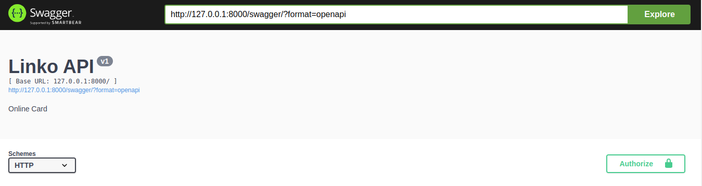
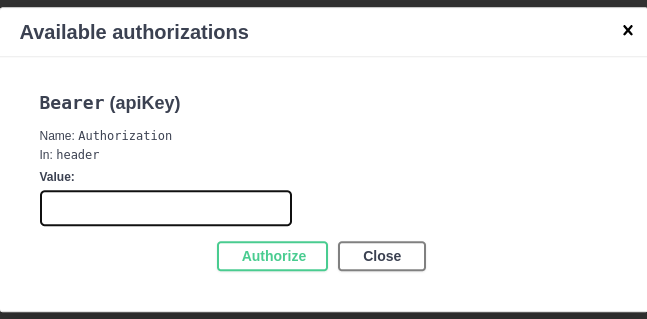

# Run the Project
To run the project build the docker images
If you want to run it for the first time, run this command:

```bash
docker-compose up --build
```

If you are using Linux and the above command throws `Permision Error` run this:
```bash
sudo docker-compose up --build
```

And to run it after first build run this command:
```bash
docker-compose up
```
or in case of `Permission Error` in Linux:
```bash
sudo docker-compose up
```

**NOTE:** Permission may occur in windows too, to resolve the issue on Windows, try to run your code as `administrator` or open a `powershell` using `adminstrative` permission and then run your code.


# Linko Swagger API

Use Swagger API for Authenticated/AllowAny API view:

- Authenticated:
  - First Create Account in `/auth/users/` **auth_users_create**

  - Go to `/auth/jwt/create/` in same section **Auth** then create `access` & `refresh` token in this api
  -  Then copy your `refresh` token and verify it in `/auth/jwt/verify/`
  -  once you've verified your token get back to `/auth/jwt/create/` and then copy your `access` token 
  -  
  Go to top of the page and click on `Authorize`:

  

  - Then in `Authorize page`:

  

  Enter **` Bearer <access> `** <br/>which `<access>` is your `access` token.

  - Then Click On `Authorize`
  - Now You can use all Authorized API

- AllowAny
  - You can use them without `Authorizing` just click on `try it out` and you can test them.


